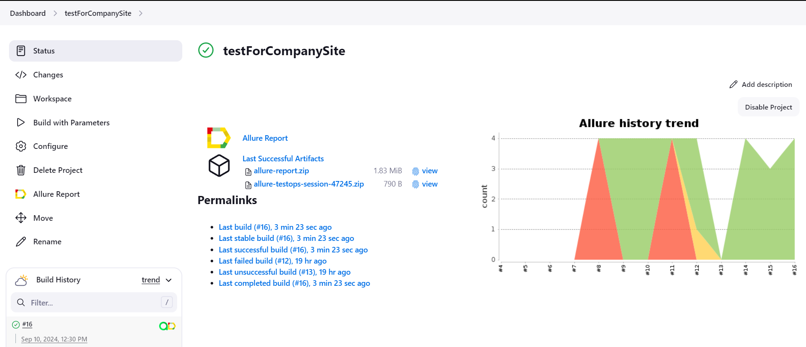
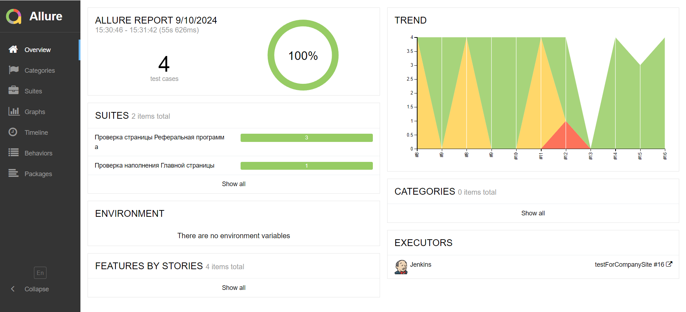
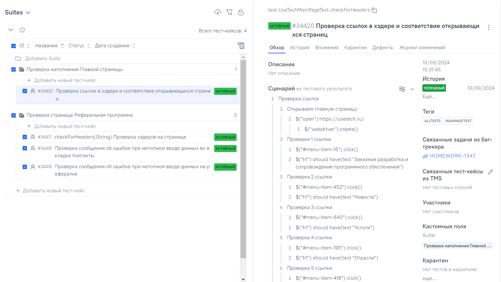
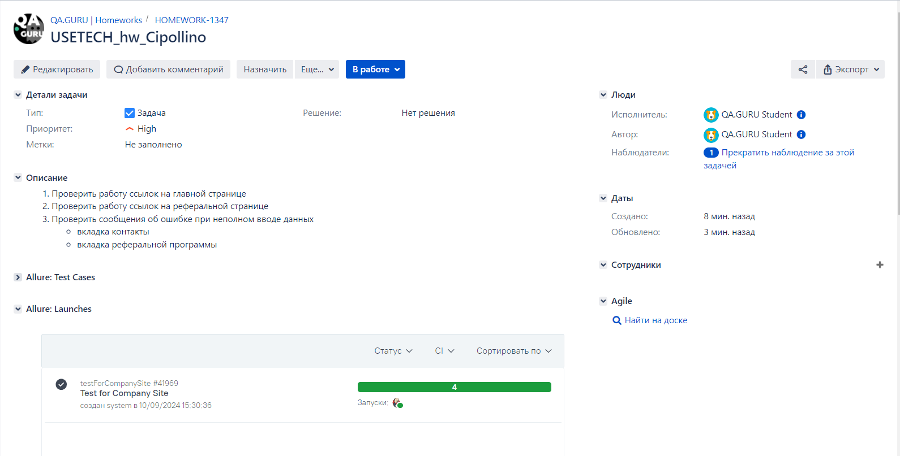

# Проект по автоматизации тестирования для <a href="https://usetech.ru/">USETECH</a></h1>
****
## Содержание:

* <a href="#tools">Технологии и инструменты</a>

* <a href="#jenkins">Сборка в Jenkins</a>

* <a href="#console">Запуск из терминала</a>

* <a href="#allure">Allure отчет</a>

* <a href="#allure-testops">Интеграция с Allure TestOps</a>

* <a href="#jira">Интеграция с Jira</a>

* <a href="#telegram">Уведомление в Telegram при помощи бота</a>

* <a href="#video">Примеры видео выполнения тестов на Selenoid</a>
****
<a id="tools"></a>
## <a name="Технологии и инструменты">**Технологии и инструменты:**</a>
<p align="center">
<a href="https://www.jetbrains.com/idea/"></a>
<a href="https://www.java.com/"></a>
<a href="https://gradle.org/"></a>
<a href="https://junit.org/junit5/"></a>
<a href="https://selenide.org/"></a>
<a href="https://www.jenkins.io/"></a>
<a href="https://aerokube.com/selenoid/"></a>
<a href="https://allurereport.org/"></a>
<a href="https://qameta.io/"></a>
<a href="https://github.com/"></a>
<a href="https://web.telegram.org/k/"></a>
<a href="https://www.atlassian.com/ru/software/jira/"></a>
</p>

****
<a id="jenkins"></a>
## </a><a name="Сборка"></a>Сборка в [Jenkins](https://jenkins.autotests.cloud/job/testForCompanySite/)</a>

<p align="center">  
<a href="https://jenkins.autotests.cloud/job/testForCompanySite/"></a>  
</p>

****
<a id="console"></a>
## Команды для запуска из терминала:

***Локальный запуск:***
```bash  
gradle clean all_tests
```

***Удалённый запуск через Jenkins:***
```bash  
clean
${TASK}
"-DbaseUrl=${BASE_URL}"
"-Dbrowser=${BROWSER}"
"-DbrowserSize=${BROWSER_SIZE}"
"-DbrowserVersion=${BROWSER_VERSION}"
"-Dremote=${REMOTE}
```
***Параметры сборки***

- REMOTE_SERVER (адрес удаленного сервера Selenoid)
- BROWSER (браузер, по умолчанию chrome)
- VERSION (версия браузера, по умолчанию 126.0)
- BROWSER_SIZE (размер окна браузера, по умолчанию 2560х1440)
- TASK (набор кейсов для запуска, по умолчанию friend_page_test)
- BRANCH (ветка, на которой надо запустить тесты, по умолчанию master)
___
<a id="allure"></a>
## </a> <a name="Allure"></a> Пример [Allure-отчета](https://jenkins.autotests.cloud/job/testForCompanySite/allure/)</a>
<p align="center">  
  
</p>  

___
<a id="allure-testops"></a>
## </a>Интеграция с <a target="_blank" href="https://allure.autotests.cloud/project/4424/dashboards">Allure TestOps</a>

### *Allure TestOps Dashboard*

<p align="center">  
  
</p>  

___
<a id="jira"></a>
## </a> Интеграция с <a target="_blank" href="https://jira.autotests.cloud/browse/HOMEWORK-682">Jira</a>

<p align="center">  
  
</p>

____
<a id="video"></a>
## </a> Примеры видео выполнения тестов на Selenoid

<p align="center">
   
</p>
